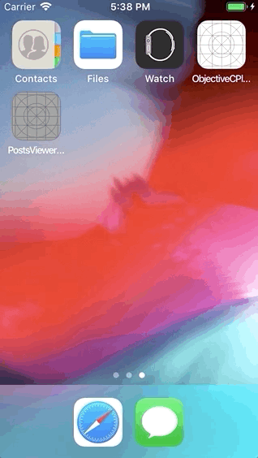

# Posts Viewer
Zero-dependency app to display a list of posts and each post details screen.

- [Clean Architecture](https://blog.cleancoder.com/uncle-bob/2012/08/13/the-clean-architecture.html) (business logic-centric) with MVVM+Coordinators for the UI layer.
- Fully unit tested.
- The code is fully modular and it could be split into completely indipendent modules/targets to improve build times.
- 100% remote data layer (no persistence).
- No need to install any dependency after cloning/downloading the repo for the first time.

## Screens

### Posts list

Each post has just a title.
The list of posts is being retrived through [this API](https://jsonplaceholder.typicode.com/posts).

When a post is tapped, the app navigates to the details screen.

### Post details

The post details screen shows

* title
* author's name
* post content (via the `body`) and
* number of comments.

Author information's being retrived through [this API](https://jsonplaceholder.typicode.com/users/1).

Similarly, comments information's being retrived throught [this API](https://jsonplaceholder.typicode.com/comments?postId=1).
